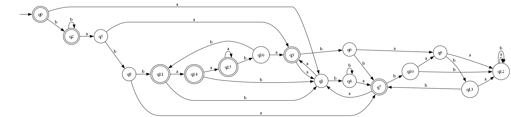
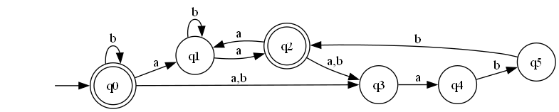

## ДКА

Таблица, доказывающая минимальность ДКА:

| prefix\suffix | ε | a | b | bb | abb | aa | ab | ba | aaa | aab | aba | bab | baa | bba | bbb | aaaa | aaab |
|:--------------|---|---|---|----|-----|----|----|----|-----|-----|-----|-----|-----|-----|-----|------|------|
| ε             | + | - | + | +  | -   | +  | -  | -  | -   | -   | +   | -   | +   | -   | +   | +    | -    |
| a             | - | + | - | -  | +   | -  | -  | +  | +   | -   | -   | -   | -   | +   | -   | -    | -    |
| b             | + | - | + | +  | +   | +  | -  | -  | -   | -   | +   | -   | +   | -   | +   | +    | -    |
| aa            | + | - | - | +  | -   | +  | -  | -  | -   | -   | +   | -   | -   | -   | -   | +    | -    |
| ab            | - | + | - | -  | -   | -  | -  | +  | +   | -   | -   | -   | -   | +   | -   | -    | -    |
| ba            | - | + | - | +  | +   | -  | -  | +  | +   | -   | -   | -   | -   | +   | -   | -    | -    |
| aab           | - | - | + | -  | +   | -  | -  | -  | -   | -   | -   | -   | +   | -   | -   | -    | -    |
| aba           | + | - | - | -  | -   | +  | -  | -  | -   | -   | +   | -   | -   | -   | -   | +    | -    |
| bab           | - | + | + | -  | -   | -  | -  | +  | +   | -   | -   | -   | +   | +   | -   | -    | -    |
| aaba          | - | - | - | +  | -   | -  | -  | -  | -   | -   | -   | -   | -   | -   | -   | -    | -    |
| abab          | - | - | - | -  | +   | -  | -  | -  | -   | -   | -   | -   | -   | -   | -   | -    | -    |
| babb          | + | + | - | -  | -   | +  | -  | +  | +   | -   | +   | -   | -   | +   | -   | +    | -    |
| aabaa         | - | - | - | -  | -   | -  | -  | -  | -   | -   | -   | -   | -   | -   | -   | -    | -    |
| aabab         | - | - | + | -  | -   | -  | -  | -  | -   | -   | -   | -   | +   | -   | -   | -    | -    |
| babba         | + | + | - | -  | +   | +  | -  | +  | +   | -   | +   | -   | -   | +   | -   | +    | -    |
| babbaa        | + | + | - | +  | +   | +  | -  | +  | +   | -   | +   | -   | -   | +   | -   | +    | -    |
| babbaab       | - | + | + | -  | +   | -  | -  | +  | +   | -   | -   | -   | +   | +   | -   | -    | -    |

## НКА

Таблица, доказывающая минимальность НКА:

|       | abb | bbb | b | a | bb | ε |
|-------|-----|-----|---|---|----|---|
| a     | +   | -   | - | + | -  | - |
| ε     | -   | +   | + | - | +  | + |
| bab   | -   | -   | + | + | -  | - |
| ab    | -   | -   | - | + | -  | - |
| ababa | -   | -   | - | - | +  | - |
| aba   | -   | -   | - | - | -  | + |

## ПКА

Изучив структуру регулярного выражения, мне не удалось найти ничего интересного. НКА уже является достаточно небольшим 
и мне не удалось найти ПКА с меньшим числом состояний, чем НКА. А так как НКА - частный случай ПКА, то его и можно считать ответом.

## Расширенное регулярное выражение

С расширенным регулярным выражением получилось что-то придумать. Добавим сразу же маркеры начала и конца, получим

$ \hat{} b*((ab^*a)^*(aabb|(babb)^*))^*\$ $

Далее расмотрим часть

$ ...(aabb|(babb)^*))^*\$ $

Так как вся эта часть обёрнута в звезду Клини, то мы можем убрать внутреннюю звезду совсем. Получим

$ ...(aabb|babb))^*\$ $

Тут же очевидно, что мы можем заменить на

$ ...(.abb)^*\$ $

Восстанавливая полное выражение, получаем

$ \hat{}b^*((ab^*a)|(.abb))^*\$ $

Так как, строго говоря, алфавит не фиксирован, то использование $ . $ не корректно без ограничения.
Тут можно пойти двумя путями:

$ \hat{}b^*((ab^*a)|([ab]abb))^*\$ $

Или

$ \hat{} (?=[ab]^*\$)b^*((ab^*a)|(.abb))^*\$ $

Также можно заменить любую звезду Клини на конструкцию вида
$ (\tau|\epsilon)^+ $, но это не упрощает выражение, а скорее наоборот делает его менее читаемым.

## Fuzz тестирование.

Исходный код программы представлен в папке code. Там находятся коды реализации автоматов и самого тестера. Некоторые важные моменты реализации:
- `#define CORRECT_TESTS_COUNT 10` определяет именно количество пройденных тестов. Сделано это потому что, во время тестирования
стало ясно, что на 1 подходящую строку приходится 6-8 неподходящих под выражение. Это можно было бы исправить изменив матрицу весов, но такой подход показался проще.
- `#define STRING_LENGTH_LOW 10` и `#define STRING_LENGTH_HIGH 20` определяют диапазон для длины строки. Значения выше создают строки ещё реже подходящие под регулярное выражение,
а строки размером меньше становятся чаще непоказательными.
- Строка генерируется только из символов `a` и `b`. Это позволяет, увеличить количество подходящих строк и
упрощает структуру автоматов (позволяет не добавлять дополнительного перехода для других букв). Также это избавляет от необходимости
использования другой библиотеки для проверки принадлежности расширенному синтаксису. Каждый раз используя `std::regex` выражения с lookahead возвращали исключение, для простоты было решено просто не использовать строки с другими символами.
Все рассуждения выше будут верны и для всего алфавита.