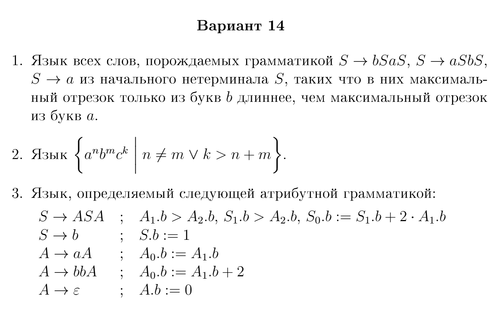

## Условие

## Решение

Заметим, что в итоговом слове в любом случае будет нечётное число букв `b`, так как A порождает их только парами (сразу `bb`), а вот  S порождает обязательно лишь один раз только 1 букву `b`. 
Далее пересечём язык с регулярным выражением `(bb)*ba(bb)*` 
После такого пересечения очевидно, что часть с нечётной длиной стоит до `a`, когда как с чётной длиной уже после этого разделителя.

Теперь необходимо соблюсти атрибутное условие. Если для  A это просто подсчёт букв `b`, то в тот момент, когда рекурсивно появляется S, всё становится сложнее. Очевидно лишь то, что количество букв `b` в левой части должно быть больше количества букв `b` в правой части, а также оба числа - чётные. 

Далее попытаемся понять, насколько больше должно быть число слева. Пускай у нас строка
$$ b^{2p} ba b^{2q} $$Опять же, далее будет подразумеваться, что p > q. Рассмотрим примеры подходящих слов
$$ bbba $$ - минимальное слово подходящее языку. Меньше него по длине ничего не принадлежит `L'`.
Добавим к q и p по +1. Получится $$ bbbbbabb = b^5ab^2 $$ Эта строка не принадлежит языку L, потому что не выполняется то условие на S. 
- Если мы берём, что S есть просто `b`, то в таком случае $$ A_2.b = 2, S_1.b = 1 => S_1 < A_2 $$ , а это уже является противоречием начальному условию
- Если же S это `bbb` (или `bbba`, принципиально ничего не изменится), то в таком случае $$ A_1.b = 2, A_2.b = 2 => A_1.b = A_2.b $$ , что тоже нарушает начальные условия, ведь A1.b обязательно больше чем A2.b
Это означает, что чтобы такая строка принадлежала языку, нам нужно дописать слева ещё `bb` и получить строку $$ b^7ab^2 $$ Эта строка будет минимальной для q = 1.
Минимальная для q = 2 будет $$ b^9ab^4$$, то есть просто +2 буквы `b` с каждой стороны, а следующий этап опять принесёт скачок
В слове $$ b^{11}ab^6 $$ возникает та же проблема, что была в слове до этого:
- Если взять S как 'bbba' - её значение $$ S_1.b = 2 * 2 + 1 = 5, A_2.b = 6 => условие \spaceнарушено $$
- Если взять S как 'bbbbba' - также не выполняется условие уже для A1. 
Стоит заметить, что здесь также S можно взять как и `bbbb(bbba)bb`, и как `bbbbbb(bbba)bbbb`, это будет влиять на то, как часто мы будем сталкиваться вот с такими проблемами. Важно, что всегда будет браться тот вариант, в котором S забирает в себя как можно больше букв - это позволит получить наименьшее число скачков и гарантировать то, что число `b` слева остаётся наименьшим для выбранного `q`
$$
\begin{aligned}
(b^3a) \\
b^4(b^3a)b^2 \\
b^6(b^3a)b^4 \\
b^4(b^6(b^3a)b^4)b^2 = b^{13}ab^6 \\
b^{15}ab^7 \\
\ldots
\\
b^{18}(b^6(b^3a)b^4)b^{16} = b^{27}ab^{20} \\
опять \space скачок ->\\ b^4(b^{18}(b^6(b^3a)b^4)b^{16})b^2 = b^{31}ab^{22} \\
\ldots
\end{aligned}
$$
Значения скачков в таком случае будут задаваться рекурсивно при переходе q через любое n_i 
$$ \begin{aligned}
n_0 = 1 \\
n_i = n_{i - 1} * 3 + 2 \\
\end{aligned}
$$
Это можно получить рассмотрев то, сколько `b` мы можем дописать не изменяя S, но это не так важно. Главное то, что таких значений n можно получить бесконечно, то есть такие скачки никогда не прекратятся.

Далее, пускай `2q` есть количество `b` справа от `a` , а `n(2q)` - минимальное количество `b` справа, полученное по нашим правилам. Получим слово
$$ b^{n(2q)} a b^{2q} $$
Теперь попробуем накачать. Пусть `q` и есть длина накачки. Очевидно, что длина слова будет как минимум `2q + 1`, попробуем накачать слово:
- Для любого разбиения `vxy`, если `v` или `y` содержит в себе `a` - сразу же выпадаем из `L'`
- Далее, если `x` не содержит в себе `a`, то тогда вся подстрока `vxy` лежит в каком либо из отрезков, либо до `a`, либо после. Если лежит до, то мы можем накачать отрицательно, тем самым и так уменьшив минимальное `n(2q)`, если же лежит после, то наоборот, увеличиваем значение `2q`, что означает, что `n(2q)` больше не подходит.
- Остаётся вариант, что `x` содержит в себе `a`. Так как оба и `v` и `y` не могут быть пусты, то опять получаем 2 случая:
		a) Если пустой подстрокой является хотя бы одна из них - задача сводится к предыдущим рассуждениям
		b) Иначе получаем ещё более сложные рассуждения...
Пусть $$
v = b^i, y=b^j $$
В случае если `j >= i` накачиваем положительно. Таким образом, в какой-то момент `n(2q) + i` станет меньше чем `2q + j` либо из-за того, что в целом `j` добавляет больше букв, чем `i`, либо из-за скачков.
Если `j < i` то делаем отрицательную накачку. В таком случае получаем строку
$$
b^{n(2q) - i}ab^{2q - j}
$$
Чтобы строка осталась в языке необходимо сравнить `n(2q - j)` и `n(2q) - i`. Если число `q` при уменьшении не проходит значений n_i (то есть не совершает скачок), то фактически мы отнимаем из левой части больше `b` чем из правой. Из структуры `L'` очевидно, что минимальное число растёт пропорционально самому `q` за исключением как раз-таки скачков. А факт непрохождения скачка мы можем зафиксировать тем, что значение `q` мы выбираем изначально приравнивая его к длине накачки. Так, если `p` оказалось неудачным и его уменьшение приводит к скачку, мы можем взять например `p + 1`. 
Итого имеем, что лемма о накачке не выполняется, а значит, пересекая изначальный `L` с регулярным языком мы получили НЕ-КС язык, а значит и начальный `L` был не КС.